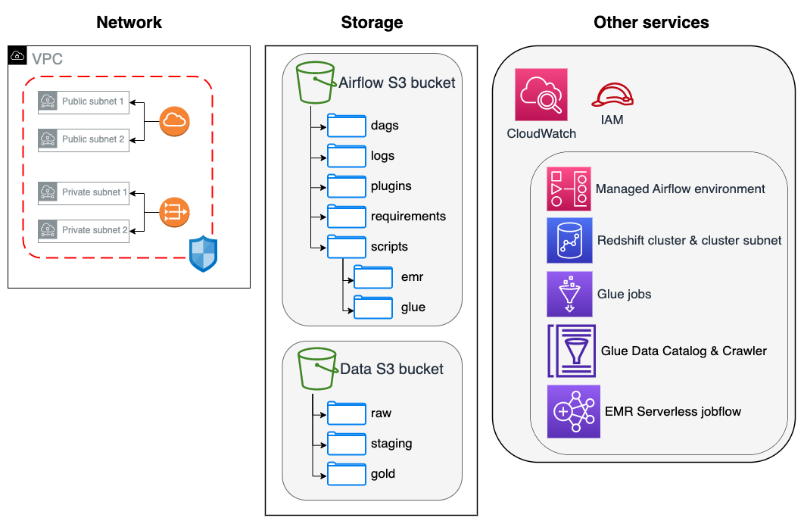
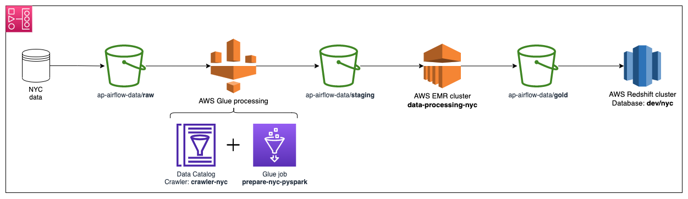
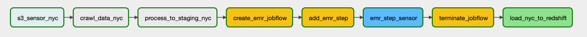

# Introduction

This repository contains code for setting up an **analytics platform** on AWS that includes services as:

* AWS Managed Workflows for Apache Airflow,
* AWS Glue,
* AWS EMR,
* AWS Redshift,
* AWS S3.

Apart from the core services used, VPC network and IAM roles structure are prepared as well.

Moreover, an exemplary pipeline is defined to showcase data processing across all of the services created. 

The whole project idea is an extension of [Amazon MWAA for Analytics Workshop](https://catalog.us-east-1.prod.workshops.aws/workshops/795e88bb-17e2-498f-82d1-2104f4824168/en-US) - highly recommended to go through it first if you don't feel fluent enough in AWS services and Terraform.  

# Repository structure

* `dags/` - Airflow DAGs definition directory
* `data/` - data directory for tests and/or local development
* `infra/` - whole Terraform code that creates AWS Analytics Platform infrastructure. Divides into `modules/` (services definition) as well as `prod/` (production environment implementation) directories. Can be easily extended into extra environments
* `logs/` - Airflow logs directory
* `misc/` - directory for the rest of the files. Includes:
  * `airflow_requirements.txt` - Airflow environment requirements, necessary for AWS MWAA setup
  * `emr_default_extra_parameters.json` - JSON to be passed inside `emr_default` Airflow connection, contains default values for EMR jobs parameters
* `plugins/` - Airflow plugins directory
* `scripts/` - directory containing Python script files for AWS EMR and AWS Glue jobs. AWS Glue jobs has been provided separately, using only PySpark library, and creating a flow inside AWS Glue Studio
* `sql/` - directory for SQL scripts used in AWS Redshift cluster
* `airflow-docker-compose.yaml` - default Airflow Docker Compose yml file, extended with airflow-amazon dependency inside
* `pyproject.toml` - repository Python environment setup file, created with [poetry](https://python-poetry.org/) framework. Mainly for local development purposes
* `README.md` - readme file containing whole repository documentation

# Platform architecture

Below you can find and architecture overview of all services included in the platform. It includes its all of the big blocks, omitting some details regarding exact names or specific parameters (everything can be found inside Terraform files). 



# Airflow - data preparation pipeline

The main idea behind this exemplary pipeline is to fetch data from S3, process it using AWS Glue and AWS EMR, and finally put it into Redshift. In this scenario, Glue and EMR could be joined together, as the tasks are pretty simple, but they're separate just to showcase both of the AWS functionalities inside AWS MWAA.





Below you can find a description each step separately:

* `s3_sensor_nyc` - sense whether there are any raw data in S3 bucket
* `crawl_data_nyc` - run AWS Glue Crawler to fetch metadata
* `process_to_staging_nyc` - execute AWS Glue job to process raw data and put it into staging directory
* `create_emr_jobflow` - starts EMR jobflow to perform data aggregation from staging directory and put it into final/gold folder 
* `add_emr_step` - adding 2 EMR jobflow steps: put script files into HDFS and execute Spark job
* `emr_step_sensor` - sense whether the jobflow has been completed, so it can be terminated
* `terminate_jobglow` - terminate jobflow so no resources are idle
* `load_nyc_to_redshift` - execute COPY command and load data from S3 to Redshift

# Setup

To properly setup the whole platform, several actions are necessary:

- For local development:
  - download aws-glue-libs Docker image (see: *WS Glue local development*)
  - download Apache Airflow Docker image (see: *Airflow local development*)
- Have AWS account available to manage services described above as a part of a platform
- Go through Terraform code to alter names, account IDs to match your preference
- Execute `terraform apply` command to create AWS infrastructure
- Sync directories: `dags`, `plugins`, `scripts`, `requirements` with respective local folders and files
- For exemplary pipeline usage:
  - Start the pipeline in AWS MWAA environment
  - Run `aws s3 cp s3://ee-assets-prod-us-east-1/modules/f8fe356a07604a12bec0b5582be38aed/v1/data/green_tripdata_2020-06.csv s3://<your-bucket>/data/raw/green/` to copy files to be sensed by S3 sensor
  - Monitor the rest of the pipeline's tasks executing

# Miscellaneous

## Security caution

This is only showcase repository, please do not deploy 1:1 what you can find here! You will need to go into Terraform infrastructure setup and carefully change parameters that will suit your environment, e.g.: objects (S3 buckets, Redshift cluster, network IDs) names, as well as internal parameters, like cluster nodes size. 

Also, only a public data has been used. Make sure your account version and existing objects' policies fit all your security constraints.

## AWS Glue local development

Even though AWS Labs provides us a great repository with all the files necessary: [aws-glue-libs](https://github.com/awslabs/aws-glue-libs), it may not be that easy to set up any version of Glue locally (believe me, I've been there..). Fortunately, there are already Docker images that can be used in that manner. More on that can be found in this [AWS Big Data blog post](https://aws.amazon.com/blogs/big-data/develop-and-test-aws-glue-version-3-0-jobs-locally-using-a-docker-container/). 

Testing using awsgluelibs comes down to run proper Docker commands. It enables to run all of 3 Spark most important commands: `spark-submit`, `pyspark`, `pytest`.

Provided example for `spark-submit` can be found below:

```
WORKSPACE_LOCATION=/local_path_to_workspace
SCRIPT_FILE_NAME=sample.py
mkdir -p ${WORKSPACE_LOCATION}/src
vim ${WORKSPACE_LOCATION}/src/${SCRIPT_FILE_NAME}

docker run -it \
-v ~/.aws:/home/glue_user/.aws \
-v $WORKSPACE_LOCATION:/home/glue_user/workspace/ \
-e AWS_PROFILE=$PROFILE_NAME \
-e DISABLE_SSL=true \
--rm \
-p 4040:4040 \
-p 18080:18080 \
--name glue_spark_submit \
amazon/aws-glue-libs:glue_libs_3.0.0_image_01 \
spark-submit /home/glue_user/workspace/src/$SCRIPT_FILE_NAME
```

## Airflow local development

This requires a bit of agility, but is also doable. With the usage of a default Airflow Docker Compose file, it's possible to set up Airflow environment and then modify it to resemble AWS MWAA. The core problem was to be able to assume the same (or at least similar privilege-wise) role as Managed Airflow cluster has. Core problems are connected with IAM, but it's worth researching, because, unfortunately, AWS MWAA DagBag doesn't refresh that often. 

The only two command to run are in fact:
```
docker-compose -f airflow-docker-compose.yaml up airflow-init
docker-compose -f airflow-docker-compose.yaml up
```

Caution - to smoothly access resources inside VPC (especially Redshift cluster), it's worth adding CIDR block representing local IP / subnet.

# Ideas for further features

- Modify IAM policies in Terraform so roles are not entitled to do anything service-wise (`iam:*`) - it's a huge security leak, but for private one-man-team showcase it was omitted to skip a lot of repeatable Terraform development
- Add CI/CD (Github Actions, CircleCI. etc.) to perform Python code formatting (e.g. black)
- Add CI/CD to format Terraform code and apply to the environment according to the branch
- Parametrize all places in code where hard-coded variable values were used (mainly in jobs' scripts, Terraform code, Airflow DAG definition)
